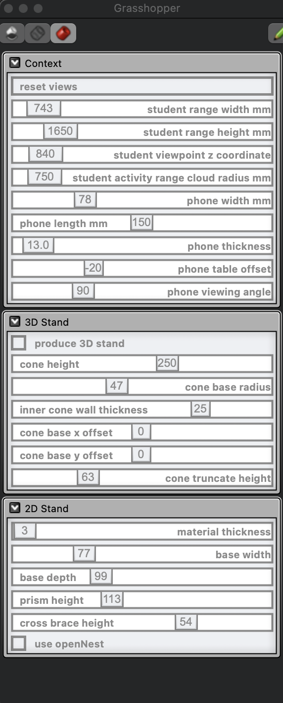
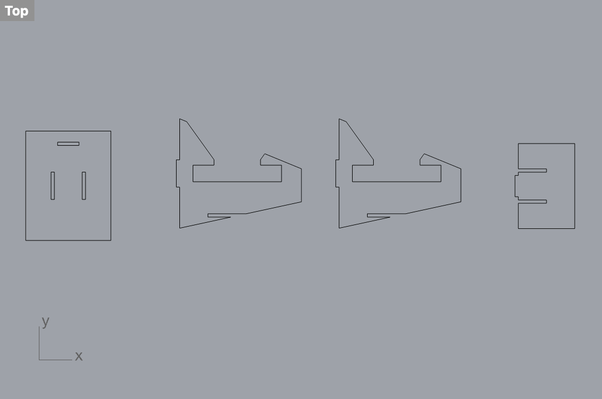
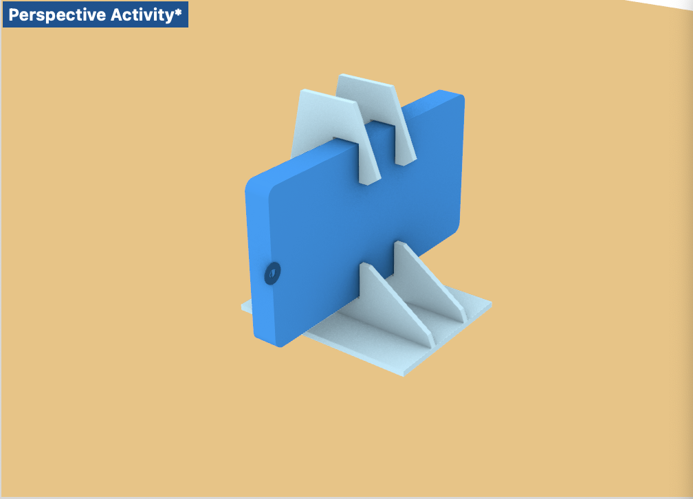

# Week 1 8/28- Phone Case in Rhino #

This week we played around with Rhino and Grasshopper which was very challenging and interesting. 

Some things I learnt:
- How to open Rhino with and without Grasshopper and toggle different viewports
- How to adjust parameters in Grasshopper and see how if affects things in Rhino
- See how coding parameters in Grasshopper is done and try (with little success) to understand the coding done by TJ in Grasshopper
- Troubleshooting Rhino+Grasshopper (with help from Cody) - 
  - Figuring out how to "bake", and export the baked results
  - Realizing that my layers were locked, which is why I couldn't access certain layers to delete older baked parts
  - How to group and disable code in Grasshopper

Things I want to figure out:
- How to adjust beyond the sliders in grasshopper and rhino, but actually make adjustments to the design (ex: curved edges with Fillet tool)
- Beginner coding in Grasshopper for a more basic object
- General practice in 3D design with Rhino

Reflection and Speculation:
It's pretty amazing that a tool like Grasshopper exists, and with some parameters and constraints it can automatically generate a design. Even speaking to Cody and other students of architecture and understanding how its used to create full sized buildings blows my mind. While it is a tool that has a high initial learning curve, I hope that over time and with more familiarity to the software, things will get easier, and it'll be more feasible to tweak ot create in this software. 
I'm curious to know how this tool designs "organic-shaped" objects with constraints. Most examples I've seen with grasshopper include some kind of latticing as well as more soft, organic features (which is the opposite of what I think of when I hear parametric design). As someone who has a lot of interest in biomimicry and nature-inspired design, I wonder if there's any way to actually feed constraints that somehow are based on the rules of nature or what we see in the natural world. 

Phone Case Exploration:
My goal with the phone case was to create a stand that can stay at a 90 degree angle in order to use as a secondary screen for online yoga classes I teach. Since it's useful for students taking to have a front and side view of the alignment of yoga poses, I often use my laptop and phone in conjunction. Having a stand that can actually keep the phone at a 90 degree angle and not "angled up" when leaning on other objects is a challenge so this would come in handy! 

I decided to laser cut my phone stand. I adjusted the context parameters to take into consideration the phone dimensions, as well as my height and dimensions (althought it didnt end up mattering since I selected the angle I wanted), and the phone angle and offset from table. I also adjusted the dimensions of the 2D stand - material thickness (since I was using 1/8 inch scrap plywood), base dimensions and cross brace height. These are the final dimensions, and appearance of the phone stand:

I also added a Warrior 2 yoga pose to be rastered on the laser cutter (just for fun). The cuts didn't come out perfect, in some places the material may have been too thick and certain lines didn't cut all the way through (I may need to use a higher power setting as well). I used a box cutter to cut through those areas which resulted in not the cleanest of lines. In addition, I set my material thickness in Grasshopper to 3 mm rather than 3.4 mm (caliper measured thickness). This resulted in slightly smaller holes and a tighter fit. I plan to use sandpaper to clean off the rough edges from the box cutter and also sand down some holes to create a better fit. I also learned that I can change the material thickness dimensions in Grasshopper to include 2 decimal points, which may have given me a better fit (and adding 0.05 mm in leeway). 

Overall it was an exciting week and I'm looking forward to sanding and assembling my phone stand! 
