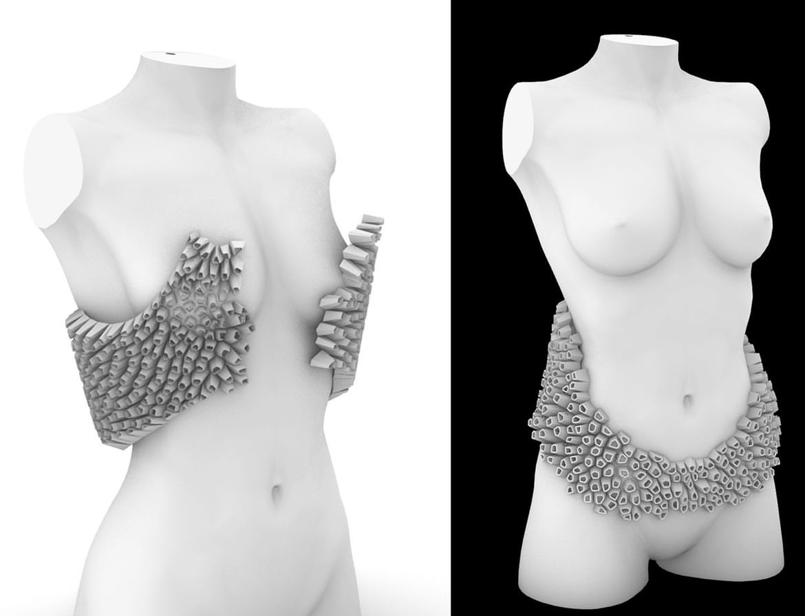
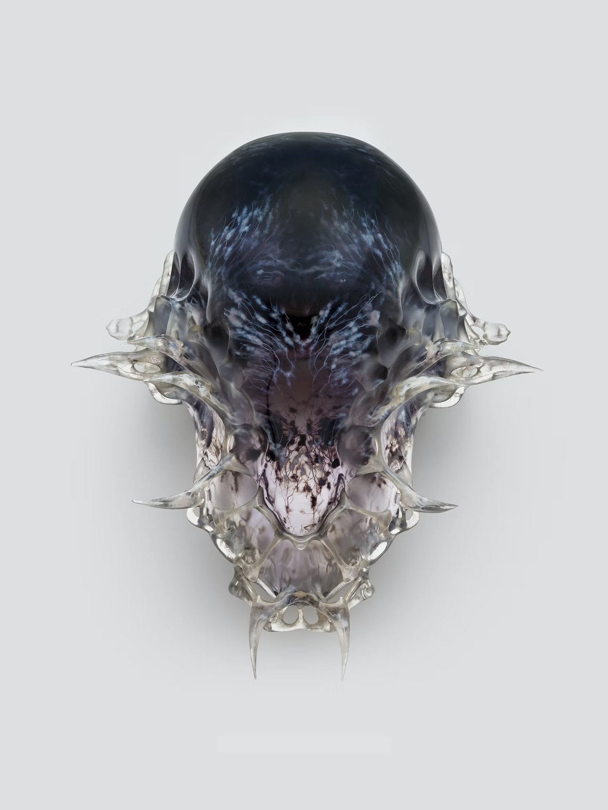

# Week 12 - 11/13 - Art and Technology #

This past week we have been doing a lot of brainstorming around our final wearable project. There are a few different aspects I explored:

Design of the wearable:
We are hoping to to a mask/face/head wearable, and use computational design to make the pattern and take inspiration from nature/biomimetic patterns. Some resources and inspiration we looked to were:
 - [Kate Reed: Meander Mask](https://www.biomimetic.io/meander)
 - [Brain Coral Patterns in Grasshopper](https://www.grasshopper3d.com/forum/topics/cracking-brain-coral-pattern-in-gh)

In addition, we looked at materials to use such as:
- [Soft Robotics Toolkit](https://softroboticstoolkit.com/resources-for-educators/soft-gripper)
- [Form 3 Pneumatic Printing](https://youtu.be/L8GJ5wxrmPY?feature=shared)

We are also looking into the mechanism of the electronics such as:
Lighting/LED's:
- [Sensoree's Wearables](https://www.sensoree.com/artifacts/)
Inflatables and Pneumatics:
- [Inflate using Drone Motors](https://makezine.com/projects/inflatable-wearables/#:~:text=ELECTRONICS%20FOR%20INFLATABLES,-Next&text=To%20make%20wearable%20interactive%20inflatables,or%20)
- [Kuan-Ju Wu's work in pneumatics](https://wukuanju.com/)

And finally, taking into consideration other questions and factors:
- What input will cause an effect on the wearable? We are looking at sensors like pulse/heartbeat, temperature, accelerometers.
- Is it possible for the user to input the changes through an app? For example, you input your emotions and feelings, and using AI it'll bucket it into various stress levels and inflate accordingly?

Other Inspirational Photos:
- Kate Reed Instagram: Barnacle Growth Logic, using mathematical Voronoi diagram

- [Neri Oxman: Vespers II, uses computationally generated designs, and heterogenous material distribution](https://oxman.com/projects/vespers-ii)

