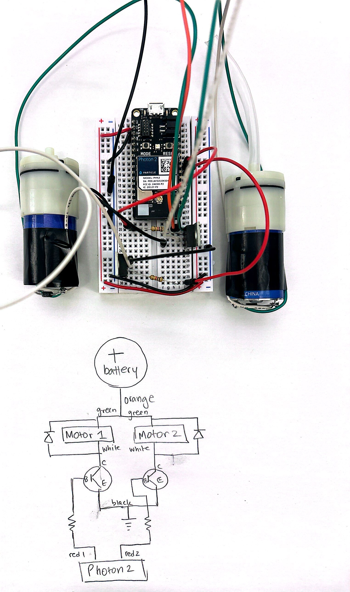
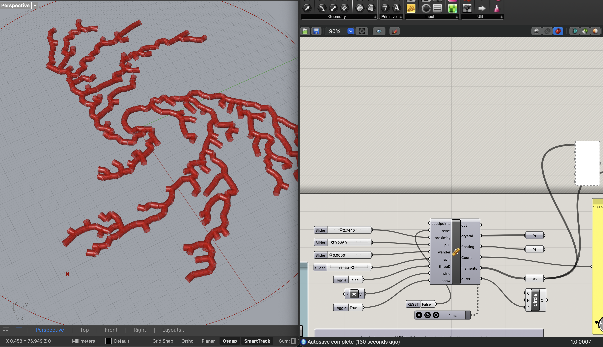
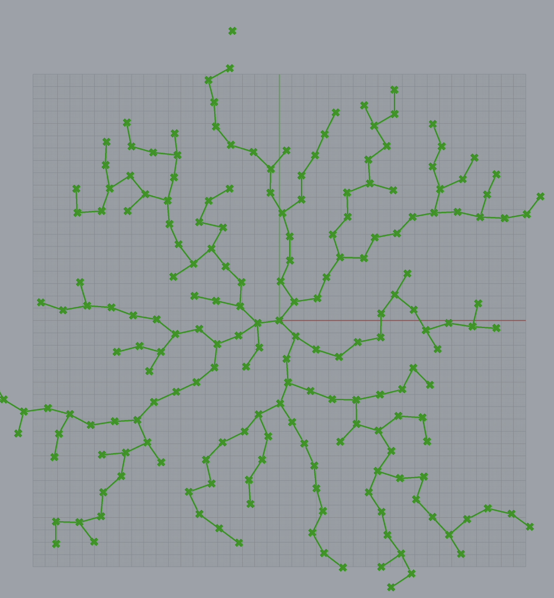
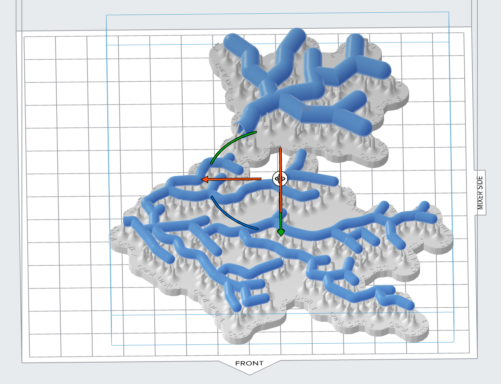

# Week 14 - 11/27 - Final Stretch #

There is officially one week left till we have showcase! A lot of progress has happened in the past week including:
 - Biomaterial 3D printer: I retrofitted an Ender 3 with a syringe extrusion mechanism to print biomaterials! Still needs some work but having no background in mechanical assembly, I am pretty proud of myself for figuring this out.
 - Electronics for the wearable: We spent yesterday figuring out all the electronics for our wearable. This includes connecting the airpumps to the photon with transistors, and a diode, as well as soldering things together. We still need to figure out our battery supply, so far we have been using the DC Power Supply to test it.
 - Wearable design: We got a finalized design in grasshopper, and exported it as an STL (see images below). We are 3D printing this in Elastic 50A resin using the Form 3, to get a final form that can inflate/deflate. 

