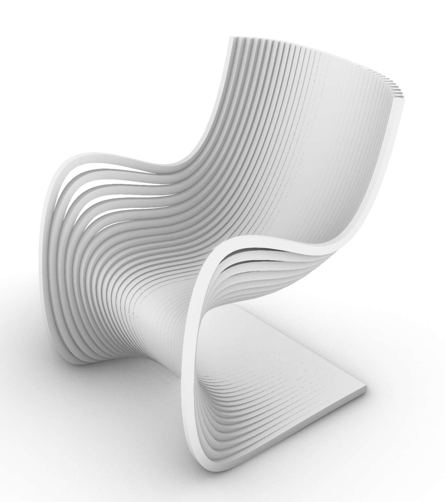

# Week 2 9/04- Making in Rhino #

This week, I spent time to continue improving/working on Rhino. 
I found that the best way for me to learn and stay engaged was to follow tutorials that make an object in Rhino, and I follow along, in the process learning new tools and applications. This allows me to explore the commands in Rhino, while also feeling excited about the prospects and not getting overwhelmed by all the information. One of the tutorials I wanted to highlight was a chair I designed by following a Pipa Chair tutorial by @Adamdereli on Youtube. The final result looked like this:

Some commands I learnt through this tutorial and in-class Rhino workshopping:
- Boolean Union/Difference/Join
- Gumball
- ExtrudeCrv
- Command+Shift+Click to select edge or surface
- Surface > Picture (to add an image to trace)
- Scale
- Render > Toggle Materials Panel (to change transparency for tracing)
- Lock (while tracing)
- Control Point Curve to draw curves
- Zoom selected (Icon)
- Option + Move Arrow = duplicate by a certain amount
- Loft (joins curves into a planar surface)
- Select all > Select Curves
- Hide Objects
- SimplifyCrv (Also under Fillet Curves) (to make a line or arc its simplest form)
- Single Point > Divide curve by number of segments (create equally spaced segments)
- Contour (series of parallel planes that cut through an object by defining the perpendicular direction, and the distance between contours)
- ExtrudeCrv (Extrudes curves (lines) into planes in the same shape)
- OffsetSrf (copies a surface or polysurface so that locations on the copied surface are the same specified distance from the original surface)

Things I want to figure out:
- Adding all the icons to the tool bar versus using the command line in Rhino
- Reference points in Rhino (start a curve at the same X or Y coordinate as another curve)
- Different ways to select objects/surfaces/lines more efficiently
- Beginner coding in Grasshopper for a more basic object
- Physically making some stuff designed in Rhino!

Reflection and Speculation:
After doing the youtube tutorials I feel like I have a slightly better sense of where a software like Rhino shines. Especially with architecture/industrial design related products that include lots of curves, non-uniform or uniform smoothed surfaces. I'm curious to find out when it's better to use a Fusion360 like tool (maybe for more structured/mechanical/simple shapes?) versus a Rhino/Grasshopper like tool. 
Also I spent some time chatting with Cody (who has so many interesting and helpful information about these softwares!) and he mentioned various use cases for the software, for example, computationally designing something that can be used on a large scale (several miles long wall) versus a small scale (furniture or bedroom wall) using the same set of code/design in Grasshopper. Or how it's helpful to optimize for a certain parameter, for example, minimize material or surface area, or maximize holes etc. While I have a better understanding in the architectural sense, I need to spend more time thinking about it for other design disciplines. 

# 9/04 Phone Stand Update #

In addition, I wanted to add an update from my phone stand last week! Last thursday, after lasercutting all the parts that week, I went to the woodshop and sanded down each flat surface. 
Since the tolerances were on the tighter side, I also used a thin file to shave off some material from the holes that the tabs fit into. Using some wood blocks and a hammer, I fit all the parts together using a pressure fit (no glue!) to create quite a sturdy stand. Here's the final images:

