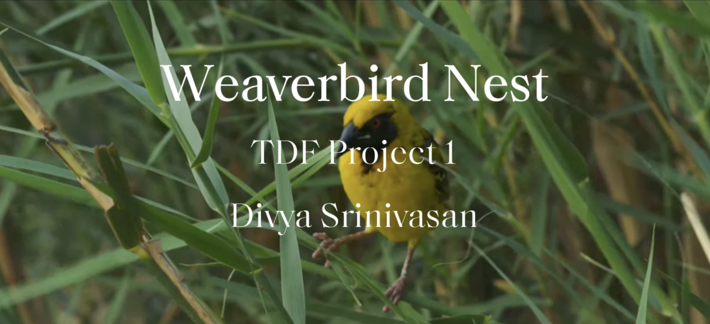

# Week 3 9/11- Grasshopper Exploration #

This week, we explored how to start from scratch in Grasshopper and make a new object. While watching many tutorials on grasshopper, I found a plugin for Grasshopper called "WeaverBird". It is a topological modeler using meshes in Rhino/Grasshopper. Baya weaverbirds are native to South Asia, and I have seen them in different areas of Karnataka, and found them very fascinating, so I thought to make a hanging weaver bird model, where the user is the bird, and has control over the shape of the nest, the entrance hole size and placement, and the mesh pattern of the nest. 

Things I learnt: 
- How to get started from scratch in Grasshopper!
- Using plugins in Grasshopper
- Many, many different functions and parameters in Grasshopper (that I'll probably need to use many more times to remember)
- Looking for appropriate online resources and tutorials, and learning how to merge it with your project
- Printing on the Prusa FDM printers
- Using Grasshopper for the Kuka Robots (training with Cody)
- Lots of help from Cody, Jeff and TJ!

Things I want to figure out:
- More refinement in outputs from Grasshopper
- Voronoi in Grasshopper
- General practice and using Rhino + Grasshopper more
- Using the Rhino Hatch patterns (from Cody)
- Learning short commands for Rhino
- Learning scripting with Grasshopper in C#
- Making art with Grasshopper

Reflection and Speculation:
I feel like the amount of progress from never touching this program, to learning so much about it has been great. Definitely an information overload and I'll need to continue playing around in the software to continue to grasp it. This was a good crash course to the software, and definitely a great way to learn how to approach new, intimidating softwares. I had always wanted to learn Rhino + Grasshopper, and would occassionally watch videos prior to this program, but never fully committed, and I think the most important things are being proactive, having a goal in mind, and asking for help! The great thing about the MDes program is being able to get help- from instructors, design specialists, and other students. I wish we had more time to continue exploring and seeing where else this software can take us, but also looking forward to the future topics we have coming up. 

Video Submission for Project 1:

