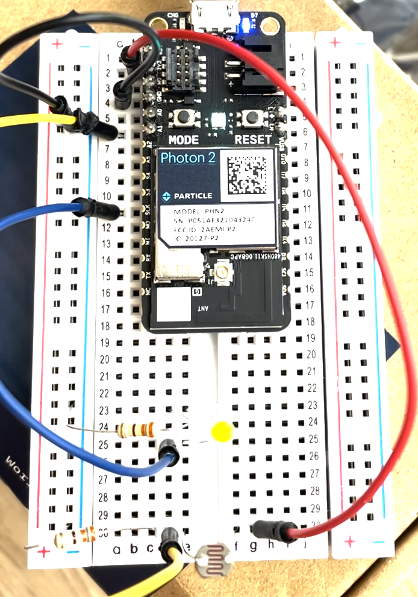

# Week 5 -9/25 - E-textiles and more! #

This week we worked on a few different things with the Photon 2! It was interesting to see how different it was from Arduino. I do see the benefits of cloud connection (although I felt like the programming was a little more difficult since there's multiple tabs to look at), and I liked that the device was smaller and fit on a breadboard. 

In class we worked on a variety of things- making LED lights blinked and using a photosensor to change the output light intensity. During class this did not work for me, so I went home and tried again and realized I was using the wrong code (it wasn't printing each line below the other) and also, I didn't use the higher resistance for the sensor (although this didn't seem to make a difference). I also realized that the code doesnt actually output any LED info, and once I understood the code better, everything made a lot more sense. 

An open question I still have is- why do we need a higher resistance for the photosensor? 

Photon 3 Ideation:
For inspiration, I decided to look at a few different places and found some interesting ways to use a microcontroller. Some were useful (displaying chart for train timings so you don't have to pull out your phone every time) and some were hilarious (attaching a fake pigeon to a drone and usnig the microcontroller to make it detect cars and "poop" on them). We ended up doing most of the ideation in class, but this research did help me understand the capabilities of the Photon 2. 

Guest Lecture:
We also had a talk by Adrian Freed and I found it very interesting. For me, the highlight was using textile with electronics embedded (e-textiles), this included using conductive thread, eeonyx materials for piexoresistance and conductive ink. I have experience with sewing and am excited to explore this domain more. The book Adrian had brought was a gold mine. Some of the most interesting things I saw were: 
- Reactive (thermochromic or UV reactive) inks to create optical effects
- Biodegradable mycelium textile MycoTEX with embedded conductive threads
- Layered chromics fabric where water and temperature affect the color and pattern of textiles
- Coating day to day objects (sticks, seeds) with gold leaf, or alumnium, and weaving them into fabric to create a circuit
- Using conductive filament to 3D print components (like snaps) onto fabric with conductive threads to create circuits

I look forward to exploring some of these ideas in the TDF projects or the future!
