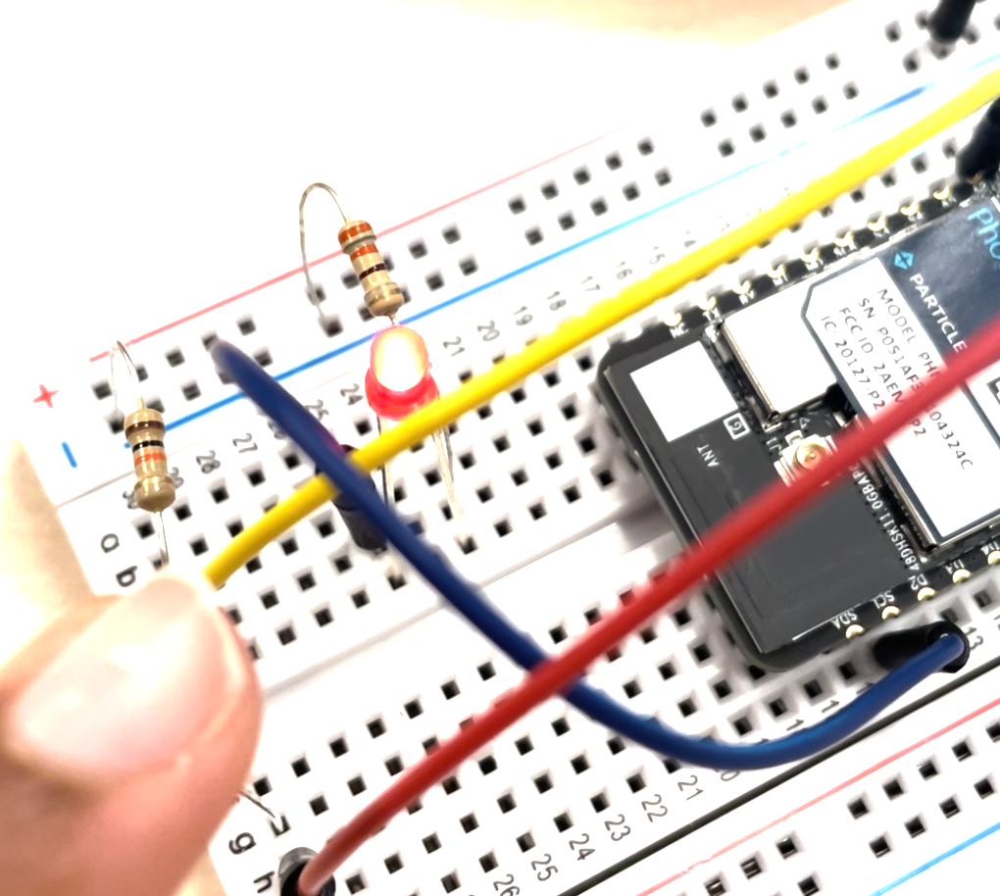
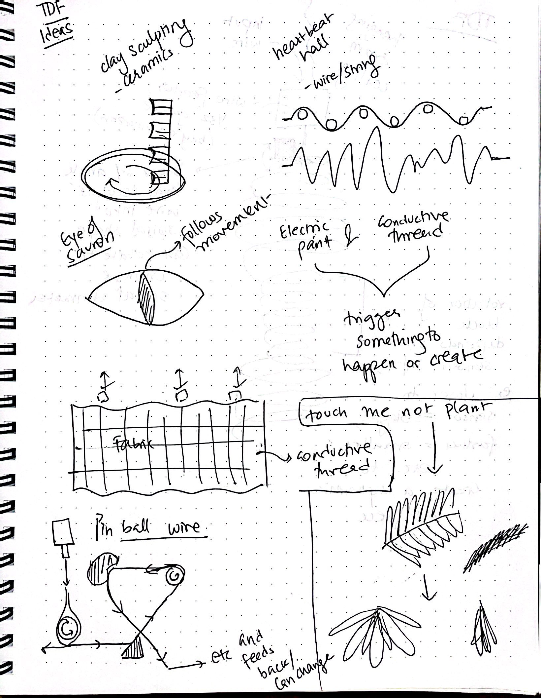

# Week 6 -10/2 - Robotic Sculptures and more! #

# Ideation Phase #

This week we had a lot of ideation and brainstorming exercises. The initial group I was paired up with was tasked to come up with some ideas for Health related electronics. This is out brainstorming chart:


We ended up finalizing 3 main topics- pill monitoring, a tangible meditation flower, and a game designed for Dementia/Alzhiemer patients. 

# Photosensitive LED Output #

In addition, I continued working on the LED and photosensor circuits we had last week. I realized, there was not output for the LED based on the photosensor input data, and I wanted to make them related (higher photosensor value = lower LED value and vice versa). With some debugging help from Sudhu, I was able to do it! Since the LED is quite difficult to tell different "dimness" values (it looked on all the time), we only mapped it from values of 0 to 150, rather than up to 255). 
Here's the code and video. 

```
SYSTEM_THREAD(ENABLED);

// LED pin definitions
//
const pin_t MY_LED_int = D7; // internal LED
const pin_t MY_LED_ext = D1; // internal LED

// Sensor pin definition -> where your LDR is plugged in
const pin_t SENSOR_PIN = A1;

// Here we are declaring the integer variable analogvalue, which we will 
// use later to store the value of the LDR.
int analogvalue; 
int threshold = 4095;
int val = 255;

// The setup() method is called once when the device boots.
void setup() {
	// Set pins to be outputs
	pinMode(MY_LED_int, OUTPUT);
    pinMode(MY_LED_ext, OUTPUT);
    
    pinMode(SENSOR_PIN, INPUT);
}

void loop() {
    
    // Read the value of the LDR and store it in the integer variable "analogvalue"
	analogvalue = analogRead(SENSOR_PIN);
	
    // print the value to the USB serial port 
    // https://docs.particle.io/tools/developer-tools/usb-serial/
    //Serial.print(analogvalue); // prints withOUT a line return after the value
    Serial.print("analogvalue: ");
    Serial.print(analogvalue); // prints WITH a line return after the value
	//Log.info("analogvalue=%d", analogvalue);
	delay(100ms);
	
	 val = map(analogvalue, 0, 4095, 150, 0);
	 Serial.print(" \t val: ");
     Serial.println(val); 
	 analogWrite(MY_LED_ext, val);
	    
// 	if(analogvalue < threshold){
// 	    // Turn on the LED
// //	    Serial.println("LED ON!");

// 	}

	// and repeat!
}
```
[](https://vimeo.com/871571270?share=copy)

# Robotic Sculpting #

Finally, I joined the Robotic Sculpting with Wire group for Project 2. We had a large group, and decided to split into 2 subgroups, with one group focusing on "Creation" and the other on "Destruction". 
After many discussions, and brainstorming, we finalized on a project that will sculpt a wire coming down from a feeder, and use a sensor to monitor how close someone is to determine the shape of sculpted wire. I think itll be a great challenge and fun project to get familiar with Photon, Sensors, Motors, Using new materials (Metal, Wire) and more! 

Here is some of the brainstorming I did ~




