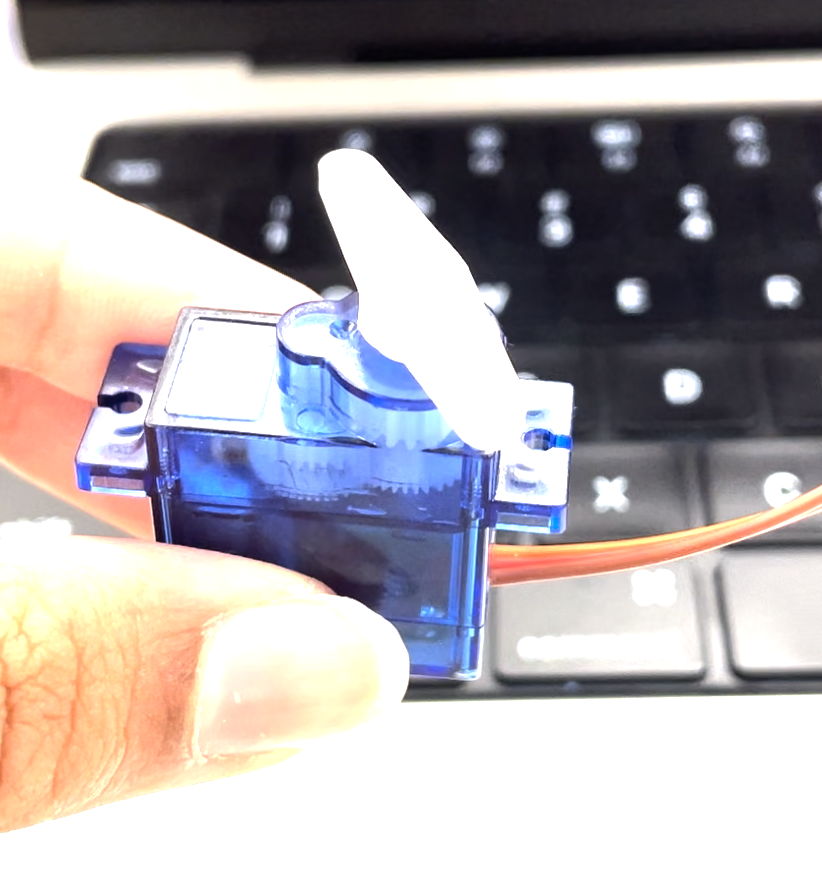
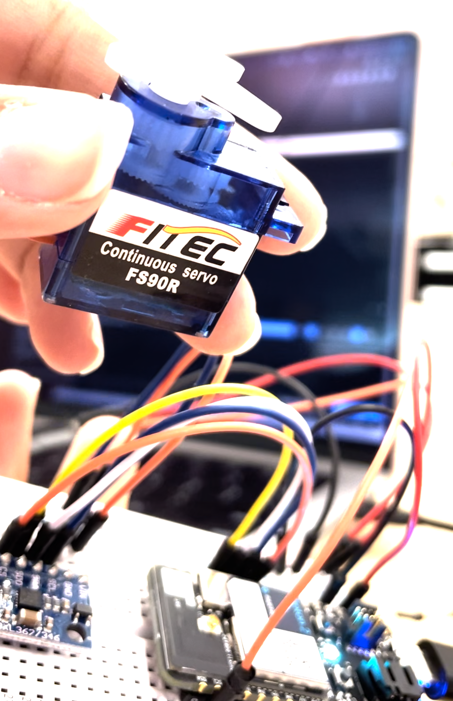

# Week 7 -10/9 - Motors and Microcontrollers! #

This week, we got started on out projects and figuring out what all the different components are. 
Some of the work we've done so far includes:

**October 4, 2023, Wednesday**
- Testing 1/8” wire with the DI Wire machine in the makerspace 
- Has the capability to bend wire left/right

**October 9, 2023, Monday**
- Tested 1/16”  wire in stainless steel and aluminum.
- Used a chisel as a bending plate to test possibilities by changing angles, pitch yaw and roll.
- Stainless steel works well since it can hold its shape and is stiffer. Aluminum was too malleable and ended up kinking in the machine.
- Wire didn't follow the exact path we expected, but we realized its because the wire was rolling while being fed.
- Was able to get a twisted wire after many attempts, shown below.

[](https://vimeo.com/873771388?share=copy)
[]

In addition, we were able to get our motors working with and without an accelerometer by following the intro tutorials on Github!

Servo Motor without Acceleromater: 

```
SYSTEM_THREAD(ENABLED);
Servo serv;

int servoPin = D1;
int pos = 0;

void setup() {
  Serial.begin(9600);
  Serial.println("Started");
  serv.attach(servoPin);
}

void loop() {
  serv.write(120);
  delay(2500);
  serv.write(90);
  delay(2500);
  Serial.println("test");
  Serial.println(serv.read());
}
```
[](https://vimeo.com/873774727?share=copy)

Servo Motor with Acceleromater: 
We had some trouble figuring out how to install the library for ADXL362, and realized it can be done directly through a function in particle workbench. However we did have to quit and reopen the software for it to start working. 

```
#include "ADXL362.h"
SYSTEM_THREAD(ENABLED);

ADXL362 adxl362;
Servo serv;

int servoPin = D1;
int pos = 0;

void setup() {
  Serial.begin(9600);
  Serial.println("Started");
  adxl362.begin(SS);
  adxl362.beginMeasure();
  serv.attach(servoPin);
}

void loop() {
  int16_t x, y, z, temp;
  adxl362.readXYZTData(x, y, z, temp);
  pos = map(x, -1200, 1200, 0, 180);
  serv.write(pos);
  Serial.println(serv.read());
  Serial.printf("x: %d y: %d z: %d\n", x, y, z);
  Serial.printf("position: %d\n", pos);
  delay(1500);
  serv.write(90);
  delay(2500);
  Serial.println("test");
}
```
[](https://vimeo.com/873775362?share=copy)

**October 11, 2023, Wednesday**
- Came up with an initial test plan to actuate the metal plate using the motor.
- We split up the roles of getting a metal plate, a hinge, and 3D printing a linear servo actuator we found on thiniverse (https://www.thingiverse.com/thing:3170748)
- Planning to run this test once the smaller wire feeder from amazon comes in!

Test Plan for Motor: 
[]
Next is figuring out the sensors!

**Bonus Pic**
We did some welding yesterday which was cool and here's a bonus photo:
[]

