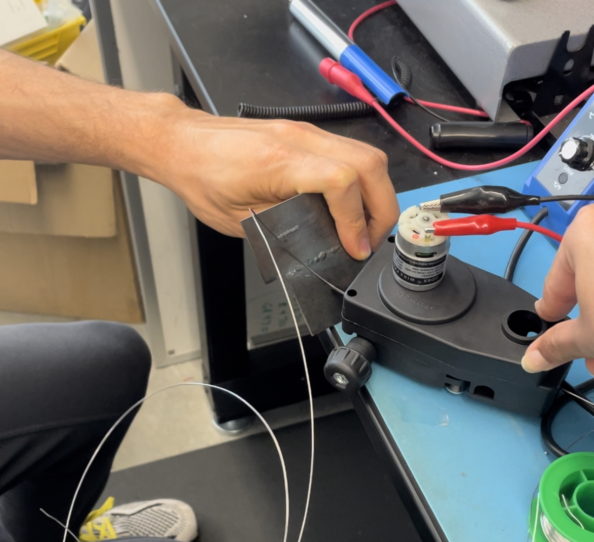

# Week 7 -10/16 - Motors and Microcontrollers! #

Phew! This was a looong week with a lot of deadlines. I'm really proud of my team and how things came together! We were able to get the full robotic wire sculpting vision made reality. 

A few things I learnt along the way:
- We purchased the Wire Feeder online and it was small but mighty! We hooked it up to a DC power supply with 5V and it worked very well with 1/32'' wire.

- I tested the Sharp IR sensor, it was quite simple to hook up and worked with a 5V power source. However I tried two different code, one digital and one analog, I found the digital code was a lot less noisy and averaged out the measured distance so we went with that.

Digital:

Analog:

- We were able to get things set up and running today, and installed the mechanics onto a pillar in the 3rd floor. Overall I think the project went great. I was a little worried about using metal, especially since I lean towards more natural, softer materials, but it was great to explore using wire and I think that it could be a great project to continue working on.
- I also wonder how we can further use AI and robotic tools like this for artistic endeavors, making larger scale models, detailed bending sculptures, or using wire as a scaffold and also depositing some other material on top as the "visible" aspect!

# Final Video #
[Link to Final Video]([https://website-name.com](https://www.canva.com/design/DAFxhUU6DyQ/Kmevwi3KIj7GeizpnEHicA/edit?utm_content=DAFxhUU6DyQ&utm_campaign=designshare&utm_medium=link2&utm_source=sharebutton)https://www.canva.com/design/DAFxhUU6DyQ/Kmevwi3KIj7GeizpnEHicA/edit?utm_content=DAFxhUU6DyQ&utm_campaign=designshare&utm_medium=link2&utm_source=sharebutton)
